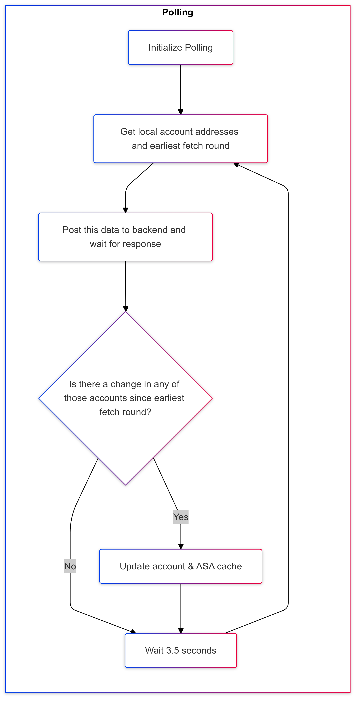
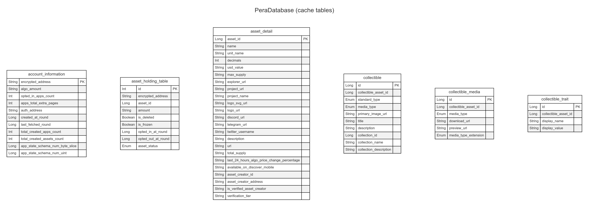

# Polling




```sh
flowchart TD
subgraph ABC["**Polling**"]
%% Nodes
    A("Initialize Polling")
    B("Get local account addresses and earliest fetch round")
    C("Post this data to backend and wait for response")
    D["Is there a change in any of those accounts since earliest fetch round?"]
    E("Update account & ASA cache")
    F("Wait 3.5 seconds")

%% Edge connections between nodes
    A --> B --> C --> D -- Yes --> E
    D -- No --> F
    E --> F
    F --> B

%% Node Shapes
    D@{shape: diam}
end
```

# Algorand Address Database


```sh
---
title: AddressDatabase
---
erDiagram
    algo_25 {
        String encrypted_address PK
        String encrypted_secret_key
    }
    ledger_ble {
        String encrypted_address PK
        String device_mac_address
        Int account_index_in_ledger
        String bluetooth_name
    }
    no_auth {
        String encrypted_address PK
    }
    hd_seeds {
        Int seed_id PK
        ByteArray encrypted_mnemonic_entropy UK
        String entropy_custom_name
        ByteArray encrypted_seed UK
    }
    hd_keys {
        String encrypted_address PK
        ByteArray encrypted_public_key UK
        ByteArray encrypted_private_key
        Int seed_id FK
        Int account
        Int change
        Int key_index
        Enum derivation_type
    }
    hd_keys ||--o{ hd_seeds : links
```

# Pera Database




```sh
---
title: Pera Database (cache tables)
---
erDiagram
    account_information {
        String encrypted_address PK
        String algo_amount
        Int opted_in_apps_count
        Int apps_total_extra_pages
        String auth_address
        Long created_at_round
        Long last_fetched_round
        Int total_created_apps_count
        Int total_created_assets_count
        Long app_state_schema_num_byte_slice
        Long app_state_schema_num_uint
    }
    asset_holding_table {
        Int id PK
        String encrypted_address
        Long asset_id
        String amount
        Boolean is_deleted
        Boolean is_frozen
        Long opted_in_at_round
        Long opted_out_at_round
        Enum asset_status
    }
    asset_detail {
        Long asset_id PK
        String name
        String unit_name
        Int decimals
        String usd_value
        String max_supply
        String explorer_url
        String project_url
        String project_name
        String logo_svg_url
        String logo_url
        String discord_url
        String telegram_url
        String twitter_username
        String description
        String url
        String total_supply
        String last_24_hours_algo_price_change_percentage
        String available_on_discover_mobile
        String asset_creator_id
        String asset_creator_address
        String is_verified_asset_creator
        String verification_tier
    }
    collectible {
        Long id PK
        Long collectible_asset_id
        Enum standard_type
        Enum media_type
        String primary_image_url
        String title
        String description
        Long collection_id
        String collection_name
        String collection_description
    }
    collectible_media {
        Long id PK
        Long collectible_asset_id
        Enum media_type
        String download_url
        String preview_url
        Enum media_type_extension
    }
    collectible_trait {
        Long id PK
        Long collectible_asset_id
        String display_name
        String display_value
    }
```
